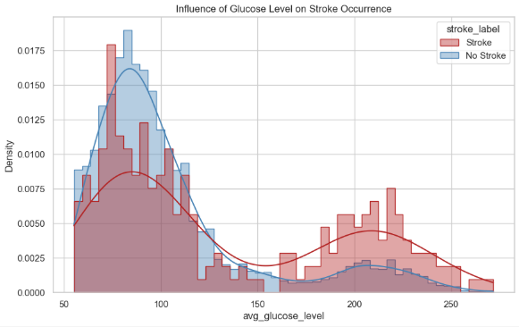
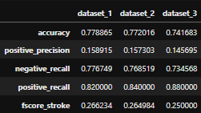
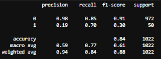

# Stroke Prediction Using Machine Learning on a Clinical Dataset

[](https://www.python.org/)
[](https://github.com/topics/machine-learning)
[](LICENSE)

## Overview
From a given dataset, the goal of this project is to train a model that predicts whether a patient has a stroke or not.
The given dataset has the following features: 
1) **id**: unique patient identifier
2) **gender**: "Male", "Female", "Other"
3) **age**: age of the patient
4) **hypertension**: 0 (if the patient doesn’t have hypertension) or 1 (if the patient has
hypertension)
5) **heart_disease**: 0 (if the patient doesn’t have a heart disease) or 1 (if the patient has
a heart disease)
6) **ever_married**: "No" or "Yes"
7) **work_type**: "children", "Govt_job", "Never_worked", "Private" or "Self-employed"
8) **Residence_type**: "Rural" or "Urban"
9) **avg_glucose_level**: average glucose level in the blood
10) **bmi**: body mass index
11) **smoking_status**: "formerly smoked", "never smoked", "smokes" or "Unknown" (in
this case the information for the patient is not available)
12) **stroke**: 1 (if the patient had a stroke) or 0 (if the patient didn’t have a stroke)
> A step-by-step explanation notebook of the project following a **CRISP-DM** workflow is included.

## Features
- **Data Processing & Analytics**
    - Data analysis: data processing, data cleaning, exploratory analysis, plotting, etc.
    - Feature Engineering & Selection: feature pruning, choice justification, feature engineering.
- **Model Development**
    - Models selection & training: motivation for selected model and training.
    - Models evaluation: comparison, evaluation metric and results interpretation.
- **Performance Optimisation**
    - Results conclusion: analysis of the different results and thoughts on improvement.
    - Optimisation solutions:
        - Synthetic Minority Over-Sampling Technique (SMOTE).
        - Hard-code thresholding layer.
- **Final Model & Perspectives for Future Work**

## Project Structure
```
stroke-prediction-ml-clinical-dataset/
│
├── README.md                                       # This file
├── Step-by-Step Explanation Notebook.ipynb         # Interactive explanation to review methode and code 
├── stroke_data.csv                                 # The clinical dataset used for the project
├── requirements.txt                                # Python libraries required
└── model/
    ├── utils.py                                    # All used libraries and usefull methods
    ├── pipeline.py                                 # Features selection & Engineering
    ├── model.py                                    # Model Training
    └── main.py                                     # End‑to‑end run with analytics
└── images/
    ├── eda_graph_example.png
    ├── datasets_benchmark_example.png
    └── model_performance_example.png
```

## Requirements
- Python 3.10+
- numpy, pandas, matplotlib, seaborn, scikit-learn, imbalanced-learn

## Installation
```bash
git clone https://github.com/<your-username>/<your-repo>.git
cd <your-repo>
python -m venv venv
source venv/bin/activate   # macOS/Linux
venv\Scripts\activate      # Windows
pip install -r requirements.txt
```

## Example Outputs
### Example of EDA graphical representation


### Example of datasets benchmark


### Example of model performance


## Next Steps
<u>**Stacked Generalization** (*stacking*):</u> Keep a Random Forest model, which is effective at capturing global patterns, and complement it with an XGBoost model, which is typically better at discriminating difficult or borderline cases and use these two models as the base learners, while a simple Logistic Regression would act as the meta‑model, learning how to combine their outputs and determining when to trust each model’s prediction.

## License
Personal project — free to use and modify for educational or demonstration purposes.
```
